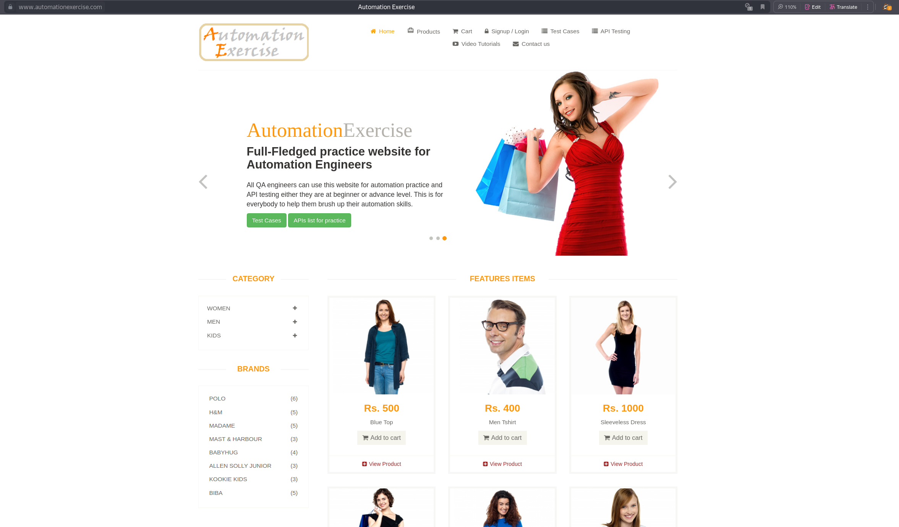

# AutomationExercise (Python). Python + Httpx + Selene

## Оглавление

* [Описание проекта](#описание-проекта)
* [Использованные технологии](#используемые-технологии)
* [Управление конфигурацией тестов](#управление-конфигурацией-тестов)
* [Важная информация](#важная-информация)
* [Нюанс с запуском параллельных тестов](#нюанс-с-запуском-параллельных-тестов)
* [Запуск тестов в IDE](#запуск-тестов-в-ide)
* [Запуск тестов в локальной среде](#запуск-тестов-в-локальной-среде)
* [Запуск тестов в Docker](#запуск-тестов-в-docker)
* [Запуск тестов в CI](#запуск-тестов-в-ci)
* [Образцы отчётов о тестировании](#образцы-отчётов-о-тестировании)

## Описание проекта

Тестовый интернет-магазин с базовой функциональностью — каталог товаров, карточки товаров, поиск, фильтры, корзина,
оформление заказа, регистрация/логин, формы обратной связи и прочее.

## Используемые технологии
- [Python v3.13](https://docs.python.org/3.13/)
- [Pytest](https://docs.pytest.org/en/stable/contents.html)
- [Pydantic v2](https://docs.pydantic.dev/latest/)
- [Httpx](https://www.python-httpx.org/)
- [Selene](https://selene-docs.readthedocs.io/en/latest/)
- [Allure 2](https://docs.qameta.io/allure/)
- [Selenoid](https://aerokube.com/selenoid/latest/)
- [Docker](https://www.docker.com/resources/what-container/)
- [Docker-compose](https://docs.docker.com/compose/)
- [Dockerfile](https://docs.docker.com/reference/dockerfile/)

## Управление конфигурацией тестов

Управлять конфигурацией можно 2 способами:
 1) Изменением значений в конфигурационном файле (`.env.local`, `.env.docker`, `.env.ci`) в папке `env`
 2) Добавлением переменных окружений через docker-compose

Приоритетными являются значения из переменных окружения, которые переопределяют значения из конфигурационного файла

Также подробное описание можно прочитать в примере конфигурационного файла `.env.local.example`

Полный список параметров конфигурации

### Изменение только через переменные окружения (так как необходимы для запуска тестов)
| Ключ             | Обязателен | Когда используется    | Описание                                                                                                                                               |
|------------------|------------|-----------------------|--------------------------------------------------------------------------------------------------------------------------------------------------------|
| ENV              | +          | Всегда                | Окружение запуска тестов. Доступные значения: local, docker, ci                                                                                        |
| PYTEST_MARK_EXRP | +          | REMOTE_TYPE != "none" | Переменная окружения, отвечающая за фильтрацию тестов по маркерам. Пример, запуск UI тестов без тестов на скриншоты "web_test and not screenshot_test" |
| PYTEST_ARGS      |            | REMOTE_TYPE != "none" | Задаются прочие аргументы запуска тестов. Например, "-vv -n 2"                                                                                         |

### Изменение через конфигурационные файлы и переменные окружения
| Ключ                                 | Обязателен | Значение по-умолчанию              | Описание                                                                                                                                                                                                                                                                        |
|--------------------------------------|------------|------------------------------------|---------------------------------------------------------------------------------------------------------------------------------------------------------------------------------------------------------------------------------------------------------------------------------|
| BASE_URL                             |            | https://automationexercise.com     | Базовый URL веб-приложения для UI-тестов                                                                                                                                                                                                                                        |
| BASE_API_URL                         |            | https://automationexercise.com/api | Базовый URL API приложения для API-тестов                                                                                                                                                                                                                                       |
| REMOTE_TYPE                          |            | none                               | Признак запуска тестов на удалённом хосте. Возможные значения: none(локально), selenoid, moon                                                                                                                                                                                   |
| REMOTE_URL                           | +          |                                    | URL для удаленного запуска тестов в Selenoid/Moon. Необходим при REMOTE_TYPE равным "selenoid" или "moon"                                                                                                                                                                       |
| BROWSER_NAME                         | +          | firefox                            | Браузер. Возможные значения: chrome, firefox                                                                                                                                                                                                                                    |
| BROWSER_VERSION                      | +          | 145.0                              | Версия браузера                                                                                                                                                                                                                                                                 |
| BROWSER_SIZE                         |            | [1920,1080]                        | Размеры окна браузера                                                                                                                                                                                                                                                           |
| BROWSER_HEADLESS                     |            | false                              | Запуск браузера в headless-режиме (не тестировалось)                                                                                                                                                                                                                            |
| BROWSER_TIMEOUT                      |            | 4                                  | Общий таймаут неявных ожиданий для команд браузера (в секундах)                                                                                                                                                                                                                 |
| BROWSER_SCRIPTS_TIMEOUT              |            | 10                                 | Таймаут для выполнения асинхронных JavaScript-скриптов (в секундах)                                                                                                                                                                                                             |
| BROWSER_PAGE_LOAD_TIMEOUT            |            | 10                                 | Таймаут на полную загрузку страницы (в секундах)                                                                                                                                                                                                                                |
| BROWSER_PAGE_LOAD_STRATEGY           |            | eager                              | Стратегия загрузки страницы. Возможные значения: `normal` (ожидает полной загрузки), `eager` (ожидает загрузки DOM)                                                                                                                                                             |
| BROWSER_DOWNLOAD_DIR                 |            | home/selenium/Downloads            | Абсолютная ссылка куда браузер будет скачивать файлы.                                                                                                                                                                                                                           |
| BROWSER_OVERRIDE_DOWNLOADED_FILE_DIR |            | (resource folder)/files/download   | Абсолютная ссылка, куда будет тест сохранять файл после скачивания браузером в контейнер тестов, при удалённом запуске                                                                                                                                                          |
| BROWSER_REMOTE_VNC                   |            | true                               | Включить VNC для удаленной сессии (позволяет наблюдать за выполнением тестов)                                                                                                                                                                                                   |
| BROWSER_REMOTE_VIDEO                 |            | true                               | Включить запись видео при удалённом запуске.                                                                                                                                                                                                                                    |
| BROWSER_REMOTE_LOGS                  |            | true                               | Включить сбор логов браузера при удалённом запуске. `BROWSER_HEADLESS`=`true` отменяет данный параметр                                                                                                                                                                          |
| BROWSER_REMOTE_AUDIO                 |            | false                              | Включить передача аудио для удаленной сессии (доступно при REMOTE_TYPE=moon).                                                                                                                                                                                                   |
| BROWSER_REMOTE_SESSION_TIMEOUT       |            | 10                                 | Таймаут удаленной сессии (в секундах). Максимальное время, которое может висеть контейнер с браузером без команд драйвера                                                                                                                                                       |
| BROWSER_HOLD_DRIVER_ON_EXIT          |            | false                              | Запускать тесты в одном и том же браузере, или отдельных. Доступно при локальном запуске.                                                                                                                                                                                       |
| DEFAULT_USER_AGENT                   |            | (value of) UserAgent.CHROME_LINUX  | User-Agent, который будет использоваться в клиентах API.                                                                                                                                                                                                                        |
| HTTP_TIMEOUT                         |            | 15.0                               | Таймаут для HTTP-запросов в API-клиенте (в секундах)                                                                                                                                                                                                                            |
| DEFAULT_EMAIL                        | +          |                                    | Email пользователя, который будет являться как ожидаемый пользователь в тестах. (Нужен для скриншот тестов)                                                                                                                                                                     |
| DEFAULT_PASSWORD                     |            | 12345                              | Пароль, используемый по умолчанию                                                                                                                                                                                                                                               |
| EMAIL_DOMAIN                         | +          |                                    | Для избежания дубликатов нужно указать домен, который будет использоваться, при генерации email.   Пример: На доменное имя `example_jan_1_1`, могут быть сгенерированы email: `shawnnavarro@example_jan_1_1.io` `michael82@example_jan_1_1.net` и т. д. |
| REWRITE_ALL_SCREENSHOTS              |            | false                              | Признак перезаписи всех скриншотов                                                                                                                                                                                                                                              |
| DEFAULT_PERCENT_OF_TOLERANCE         |            | 0                                  | Допустимый процент отклонения пикселей при сравнении скриншотов (от 0.0 до 0.2). Используется в скриншот тестах                                                                                                                                                                 |
| DEFAULT_SCREENSHOT_TIMEOUT           |            | 0.1                                | Минимальное ожидание (в секундах) перед каждым скриншотом                                                                                                                                                                                                                       |
| ALLURE_ATTACH_TEST_ARTIFACTS         |            | failed                             | Признак добавления тестовых артефактов в Allure                                                                                                                                                                                                                                 |
| ALLURE_ATTACH_TEST_VIDEO             |            | failed                             | Признак добавления видео тестов в Allure                                                                                                                                                                                                                                        |
| EXPECTED_PRODUCT_ID                  |            | 3                                  | ID товара, который считается как ожидаемый. Нужен для скриншот тестов                                                                                                                                                                                                           |
| EXPECTED_PRODUCT_IDS                 |            | {1, 2, 3, 5, 8}                    | Набор ID товаров, которые отображаются как ожидаемые. Нужны для скриншот тестов                                                                                                                                                                                                 |
| RECOMMENDED_PRODUCT_IDS              |            | {1, 2, 3, 5, 8}                    | Набор ID товаров, которые отображаются как рекомендованные.                                                                                                                                                                                                                     |
| EXPECTED_CREDIT_CARD                 |            |                                    | Данные ожидаемой кредитной карты. Пример указан в файле `.env.local.example`. (На данный момент не актуален, поскольку отсутствует тест на проверку отображения формы с заполненными данными карты)                                                                             |
| PATH_TO_FILES                        |            | (resource folder)/files/downloads  | Абсолютный путь к папке с файлами, используемые, для загрузки.                                                                                                                                                                                                                  |
| LOG_LVL                              |            | INFO                               | Отображает в консоли логи заданного уровня и выше. Возможные значения: DEBUG, INFO, WARNING, ERROR, FATAL                                                                                                                                                                       |
| API_LOG_LVL                          |            | HEADERS                            | Уровень детализации логирования для API-клиента. Возможные значения: NONE, BASIC, HEADERS, BODY                                                                                                                                                                                 |
| GH_API_URL                           |            | https://api.github.com             | Базовый URL для API GitHub                                                                                                                                                                                                                                                      |
| GH_TOKEN                             | +          |                                    | Fine-grained PAT-токен. Создать по [ссылке](https://github.com/settings/personal-access-tokens) или перейти в Settings -> Developer Settings -> Personal access tokens -> Fine-grained tokens.   ***Необходимые права: Issues (read-only)***                            |
| GH_TOKEN_NAME                        | +          |                                    | Название Fine-grained PAT-токена                                                                                                                                                                                                                                                |
| GH_ACCOUNT_NAME                      | +          |                                    | Имя профиля репозитория в github. Если делали fork репозитория, то нужно указать имя аккаунта.                                                                                                                                                                                  |
| GH_REPO_NAME                         | +          |                                    | Имя репозитория в github. Если делали fork репозитория то нужно указать имя аккаунта.                                                                                                                                                                                           |

## Важная информация
### 1) Установи необходимое ПО:

Маленький список ПО:
1) python 3.13
2) poetry
3) allure-commandline (опционально, если хочешь красивый отчет после тестов)

Рекомендация по Allure:
Для установки allure-commandline v.2.35.1. На версии 2.36 были с отсутствием Content-Type в некоторых attachment'ах.
А в allure3 были ошибки с отображением screen-diff.

### 2) Зарегистрируй своего пользователя на https://automationexercise.com

Данный пользователь станет "ожидаемым пользователем". В полях `DEFAULT_EMAIL`, `DEFAULT_PASSWORD` укажите те данные,
которые использовали при регистрации.

### 3) Заполни все обязательные параметры конфигурации

Заполни все обязательные поля, которые указаны в табличках
[Управление конфигурацией тестов](#управление-конфигурацией-тестов).
Также убедись, что введённые данные являются корректными.

Например:
Указывая `BROWSER_NAME` и `BROWSER_VERSION` убедись, что данные, что данные браузер у вас есть на хосте,
если запускаешь локально, либо убедись что данные браузеры содержаться в
`env` -> `docker` -> `selenoid` -> `local/ci` ->`browsers.json`  

### 4) Первый запуск тестов со скриншотами
Для запуска тестов со скриншотами рекомендуется использовать `BROWSER_PAGE_LOAD_STRATEGY`=`normal`.
Для обычных UI тестов достаточно `BROWSER_PAGE_LOAD_STRATEGY`=`eager`

При первом запуске скриншот тестов, нужно указать переменную окружения `REWRITE_ALL_SCREENSHOTS`=`true`.
При этом тесты не упадут в момент проверки скриншота. Проверить корректность сохранённых скриншотов.
Если остались некорректные скриншоты, то повторяй подпункты ниже до тех пор, пока все скриншоты окажутся корректными,
после которых можно запускать тесты без переменной окружения и признака перезаписи в проверке. Шаги: 
   1) устанавливаем переменную окружения `REWRITE_ALL_SCREENSHOTS`=`false`,
   2) запускаем тесты 
   3) выбираем из тестов с некорректными скриншотами тесты с уникальными путями скриншотов
   4) эти тесты (из п.2) помечаем/оставляем маркером `@pytest.mark.debug_test` (у других тестов должен отсутствовать маркер)
   5) в вызове метода проверяющего скриншот добавляем именованный аргумент `rewrite_screenshot=True`
   6) перезапускаем тесты
   7) если остались некорректные скриншоты, то возвращаемся к п.3, иначе переходим к следующему пункту
   8) Убираем:
      1) переменную окружения `REWRITE_ALL_SCREENSHOTS`=`false`
      2) именованные аргументы `rewrite_screenshot=True`
      3) убрать маркеры над тестами `@pytest.mark.debug_test`
   9) Запускаем скриншот тесты

## Нюанс с запуском параллельных тестов

Запускать тесты параллельно можно, но НЕ РЕКОМЕНДУЕТСЯ.

Данный веб-сайт не имеет больших ресурсов и является открытым для всех.
Параллельный запуск (даже в 2 потока) может приводить к ошибкам разного вида например:

### API

### UI:

#1 This website is under heavy load (queue full)

## Запуск тестов в IDE

1) Открыть проект в IDE
2) Выполни команду: `poetry env use 3.13`
3) Укажи интерпретатор python, и путь к Poetry в настройках IDE
4) Скачай зависимости проекта выполнив команду в консоли `poetry install`
5) В папке `env` сделать дубликат `env.local.example` под новым именем `env.local`
6) Указать все обязательные значения конфигурации, кроме `ENV`
7) Добавить в конфигурацию запуска тестов:
   1) переменную окружения `ENV`=`local`
   2) параметр запуска `--alluredir`=`/absolute/path/to/folder/allure-results`  
   (для удобства рекомендую создать папку allure-results в корне проекта)
8) Запускай тесты
9) После прохождения тестов, отчет можно посмотреть по команде: `allure serve allure-results`

## Запуск тестов в локальной среде

1) Открой консоль в папке проекта
2) Выполни команду: `poetry env use 3.13`
3) Скачай зависимости проекта `poetry install`
4) В папке `env` сделать дубликат `env.local.example` под новым именем `env.local`
5) Указать все обязательные значения конфигурации, кроме `ENV`
6) Добавь переменную окружения `ENV` со значением `local`
7) Запускай тесты `pytest -v -m "{тут_укажи_выражение_из_маркеров}"`
8) После прохождения тестов, отчет можно посмотреть по команде: `allure serve allure-results`

## Запуск тестов в Docker

Перед запуском тестов убедись:
1) Свободно не менее 8 Гб в хранилище docker
2) Скачай образ записи видео с контейнеров: `docker pull selenoid/video-recorder:latest-release`
3) Чтобы хранить видео тестов, выполни команду: `mkdir /opt/selenoid && chmod -R 777 /opt/selenoid`
4) Также нужно сделать данную папку доступной как ресурс внутри docker.  
Перейди в docker `Settings -> Resources -> File sharing` и добавь путь: `/opt/selenoid` 
Также нужно добавить в ресурсы путь к своему проекту `/path/to/project`, для доступа к allure-results и папке со скриншотами.  
Для простоты лучше указать директорию пользователя, так будет удобнее и в других проектах.
5) Измени значение `IMAGE_PREFIX` на свой в `docker.properties`.

### Локальный Docker + Selenoid

1) Открой консоль в папке проекта
2) В папке `env` сделать дубликат `env.local.example` под новым именем `env.docker`
3) Укажи все обязательные значения конфигурации:
   1) либо указывая все значения в конфигурационном файле, кроме `ENV`
   2) либо добавь переменные окружения, включая `ENV`=`docker`:  
   `export ENV=docker`  
   `export PYTEST_MARK_EXPR="web_test and not screenshot"`  
   `export GH_TOKEN=...`  
   ...
   и другие
4) При необходимости можешь указать и опциональные переменные значения конфигурации.
`PYTEST_ARGS="-vv"`, `BROWSER_NAME=chrome`, `BROWSER_VERSION=128.0` и т. д.
5) Запускай команду `bash run_project.e2e.sh`
6) Дождись пока все контейнеры поднимутся, а после контейнер `automation-exercise-test` остановиться
7) Открой отчеты allure: `allure serve allure-results`

### Локальный Minikube + Moon

Coming soon

## Запуск тестов в CI

Перед первым запуском тестов в GitHub CI, необходимо:
1) Создать ветку `gh-pages` (для хранения allure отчетов)
2) Удалить все содержимое ветки
3) Запушить изменения
4) Создать ветку `workflow-resources` (для хранения необходимых артефактов для тестов)
5) Удалить все содержимое ветки
6) Создать папку `screenshot` в ветке `workflow-resources` (для хранения скриншотов)
7) Запушить изменения
8) Добавить необходимые секреты и переменные окружения в настройках репозитория
9) В GitHub в разделе `Action` запустить workflow `Screenshot test run`, включив чекбокс `Rewrite all screenshots`.  
При необходимости перезаписать скриншоты некоторых тестов, добавляем маркер `@pytest.mark.debug_test`
над нужными тестами и запускаем workflow `Screenshot test run`, 
включив чекбоксы `Rewrite all screenshots` и `Run tests with debug marker`

## Образцы отчётов о тестировании

### API

#### API Tests Dashboard

#### API Test Example

### WEB
#### Web Tests Dashboard

#### WEB Failed Test Example

#### WEB Passed Test Example

### Screenshot

#### Screenshot Tests Dashboard

#### Screenshot Test Example

### All tests

#### All Tests Dashboard

#### All Tests Behaviours + Disabled test by GitHub Issue

